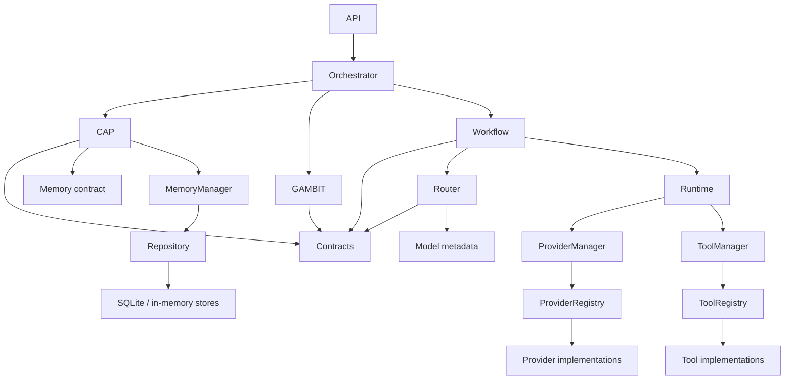

# Samaktha Core
## Architecture State
### Phase 1 AI Infrastructure

Version: v0.1.0

This document records the implementation state of the repository immediately after completion of Phase 1. It is an internal engineering record. The source code and tests are authoritative when this document and implementation diverge.

---

## 1. Project Vision

Samaktha is intended to become an architecture-first orchestration system for AI-assisted work. Its long-term direction is to separate governance, goal understanding, planning, routing, execution, memory, and tools so each concern can evolve without collapsing the boundaries between them.

Phase 1 establishes those boundaries and their contracts. It provides a deterministic request pipeline, typed planning and runtime models, provider/model registries, provider execution infrastructure, persistent memory primitives, tool registration, and an HTTP application surface. Phase 1 is a foundation; it does not constitute an autonomous agent system or a complete intelligence layer.

---

## 2. Architecture Overview

### API Layer

**Purpose**

Expose the application through FastAPI.

**Responsibilities**

- Construct the application and include HTTP routers.
- Validate incoming execution payloads using API schemas.
- Resolve the application orchestrator from request state.
- Return health and execution responses.

**Public interfaces**

- `app.api.execute.router`
- `app.api.health.router`
- `ExecuteRequest` and `ExecuteResponse` in `app/api/schemas.py`
- `create_app(settings)` in `app/core/app.py`
- ASGI object `app` in `main.py`

**Dependencies**

FastAPI, application settings, and the orchestrator boundary.

**Status**

Implemented. FastAPI integration and health/execution routes are wired.

**Limitations**

The API layer is intentionally thin. Authentication, authorization middleware, request queues, background scheduling, and distributed request handling are not implemented.

### Orchestrator

**Purpose**

Coordinate the end-to-end request pipeline without implementing the specialized behavior owned by its subsystems.

**Responsibilities**

- Invoke CAP context preparation.
- Invoke GAMBIT planning.
- Pass the execution plan through Workflow Engine.
- Return the final runtime/workflow result.
- Translate pipeline state into the final response shape.

**Public interfaces**

- `SamakthaOrchestrator.run(...)`
- `SamakthaOrchestrator.run_pipeline(...)`
- `PipelineState`

**Dependencies**

CAP `ContextEngine`, GAMBIT `Planner`, `ModelRouter`, Runtime, and `WorkflowEngine`.

**Status**

Implemented as the composition boundary in `app/core/orchestrator`.

**Limitations**

The orchestrator coordinates the currently implemented path; it does not provide autonomous looping, multi-agent coordination, or parallel plan execution.

### CAP

**Purpose**

Provide context assembly and governance before planning and execution.

**Responsibilities**

- Build prepared context from conversation messages.
- Retrieve memory through the `MemoryReader` contract.
- Classify privacy categories.
- Evaluate policy, action risk, permissions, and approval requirements.
- Detect ambiguity and produce ambiguity candidates.

**Public interfaces**

- `ContextEngine.build(...)`
- `PrivacyClassifier.classify(...)`
- `PolicyEngine.evaluate(...)`
- `ApprovalEngine.decide(...)`
- `AmbiguityResolver.check(...)`
- CAP models and policy contracts in `app/core/contracts`.

**Dependencies**

Conversation, policy, and memory contracts. CAP may consume memory through an abstract reader; it does not depend on SQLite implementation details.

**Status**

Implemented as the governance/context subsystem.

**Limitations**

CAP does not execute providers or tools, does not route models, and does not implement a persistent approval workflow beyond the available permission-store abstractions.

### GAMBIT

**Purpose**

Convert a user goal into a structured execution plan.

**Responsibilities**

- Parse goals and constraints.
- Estimate goal complexity and context tokens.
- Search the skill registry.
- Decompose goals into plan tasks.
- Build workflow steps.
- Reflect over available execution outcomes and derive lessons/follow-ups where supported by the current models.

**Public interfaces**

- `Planner.plan(...)`
- `GoalParser.parse(...)`
- `TaskDecomposer.decompose(...)`
- `InMemorySkillRegistry.search(...)`
- GAMBIT planning models and contracts.

**Dependencies**

Planning contracts and the in-memory skill registry. GAMBIT produces plans for Workflow and Router; it does not access Memory directly.

**Status**

Implemented planning foundation.

**Limitations**

Planning is deterministic and bounded. There is no autonomous replanning loop, self-modifying plan, multi-agent planner, or parallel planning/execution strategy.

### Workflow Engine

**Purpose**

Represent and coordinate execution of tasks derived from an `ExecutionPlan`.

**Responsibilities**

- Convert plans into workflow tasks.
- Track workflow/task state.
- Request routing decisions for workflow tasks.
- Dispatch work through Runtime.
- Collect task outcomes.

**Public interfaces**

- `WorkflowEngine.execute(...)`
- `WorkflowEngine.run(...)`
- `WorkflowState`, `WorkflowTask`, and `WorkflowResult`.

**Dependencies**

Planning contracts, Router, and Runtime.

**Status**

Implemented.

**Limitations**

The current engine does not provide parallel workflows, durable workflow queues, background scheduling, distributed coordination, or autonomous recovery.

### Runtime

**Purpose**

Execute routed tasks through the correct execution adapter.

**Responsibilities**

- Dispatch provider tasks to `ProviderExecutor`.
- Dispatch tool tasks to `ToolExecutor`.
- Resolve providers through `ProviderManager`.
- Preserve the `RuntimeResult` contract, including an empty dictionary output for failed executions.
- Return task status, routing, output, and error information.

**Public interfaces**

- `RuntimeEngine.run(...)`
- `RuntimeDispatcher.dispatch(...)`
- `ProviderExecutor.execute(...)`
- `ToolExecutor.execute(...)`
- `RuntimeResult`, `RuntimeTask`, and `RuntimeContext`.

**Dependencies**

Runtime contracts, Router decisions, ProviderManager, and ToolManager protocols.

**Status**

Implemented. Runtime supports normal provider execution and provider-manager integration, including optional streaming at the provider-manager boundary.

**Limitations**

Runtime does not own planning, routing policy, provider HTTP logic, memory persistence, or tool registration. Streaming is exposed as provider infrastructure and is not a separate API response protocol in the current Runtime result model.

### Router

**Purpose**

Select a model/provider registration for a planned task.

**Responsibilities**

- Match routing requests to registered capabilities.
- Apply routing policy and the existing scoring engine.
- Produce a `RoutingDecision` containing provider/model identity and reasoning metadata.

**Public interfaces**

- `ModelRouter.route(...)`
- `RouterRegistry`
- `CapabilityRegistry`
- `ScoringEngine.rank(...)`
- `RoutingDecision`, `RouterRequest`, and routing registration models.

**Dependencies**

Router-local registrations, capability metadata, scoring policy, and optional `ModelManager` wiring.

**Status**

Implemented as Router v0.2 with deterministic scoring behavior preserved.

**Limitations**

Router does not execute providers, make HTTP calls, perform health pings, retry, or implement fallback. Provider availability and fallback belong to ProviderManager.

### Model Registry

**Purpose**

Separate model identity and capability metadata from provider implementations.

**Responsibilities**

- Register `ModelInfo` records.
- Resolve models by model ID.
- List all models or models belonging to a provider.
- Store context, output, capability, and scoring metadata.

**Public interfaces**

- `ModelRegistry.register(...)`
- `ModelRegistry.get(...)`
- `ModelRegistry.list_models(...)`
- `ModelRegistry.list_by_provider(...)`
- `ModelManager.register_model(...)`
- `ModelManager.resolve_model(...)`

**Dependencies**

Pydantic model metadata only. The registry does not execute providers.

**Status**

Implemented as Model Registry v0.1. Application wiring registers foundation models for mock, OpenAI, Groq, OpenRouter, and local execution.

**Limitations**

There is no dynamic model discovery, remote catalog synchronization, version lifecycle management, or model capability verification against live provider APIs.

### Provider System

**Purpose**

Manage provider implementations and execute provider-backed inference behind one Runtime-facing entry point.

**Responsibilities**

- Register providers and provider metadata.
- Inspect enabled/configured status without network access.
- Select providers deterministically.
- Execute cloud, local, or mock providers.
- Normalize responses to `ProviderResponse`.
- Support optional streaming.
- Apply deterministic fallback without retrying a provider twice.
- Track temporary in-memory cooldowns after rate limits and temporary failures.
- Validate context windows from provider metadata.
- Track usage, estimate cost locally, and expose process-local metrics.

**Public interfaces**

- `ProviderRegistry.register(...)`
- `ProviderRegistry.get_provider(...)`
- `ProviderManager.resolve_provider(...)`
- `ProviderManager.execute_provider(...)`
- `ProviderManager.execute_provider_stream(...)`
- `ProviderManager.get_provider_status(...)`
- `ProviderManager.select_provider(...)`
- `ProviderManager.get_provider_metrics(...)`
- `ProviderInfo`, `ProviderResponse`, `ProviderSettings`, `ProviderStatus`.

**Dependencies**

Provider contracts, `httpx` for explicit HTTP execution, Pydantic settings, model/provider metadata, and Runtime through the manager boundary.

**Status**

Implemented Phase 1 provider infrastructure. OpenAI, Groq, and OpenRouter use OpenAI-compatible HTTP endpoints. Local execution uses a configurable local endpoint. MockProvider remains deterministic.

**Limitations**

Health checks do not establish reachability. Cooldowns and metrics are process-local. There is no Redis, distributed metrics, dynamic discovery, provider billing reconciliation, function calling, embeddings, vision, or audio execution.

### Memory System

**Purpose**

Provide storage and retrieval primitives for context and application memory.

**Responsibilities**

- Expose abstract memory operations.
- Store, retrieve, delete, list, and search records.
- Normalize memory categories.
- Provide SQLite and in-memory stores.
- Expose memory through `MemoryManager` and repository abstractions.

**Public interfaces**

- `Memory.read(...)`, `write(...)`, and `delete(...)`
- `MemoryManager.search(...)`
- `MemoryRepository`
- `SQLiteStore` and `InMemoryStore`
- `MemoryReader`, `MemoryRecord`, and memory contracts.

**Dependencies**

Python standard-library SQLite for the SQLite backend and CAP memory contracts.

**Status**

Implemented with SQLite persistence and an in-memory store.

**Limitations**

There is no semantic search, embeddings, vector database, distributed storage, retention policy engine, or background indexing.

### Tool System

**Purpose**

Register and execute non-provider capabilities through Runtime.

**Responsibilities**

- Define the tool interface and result contract.
- Register tool implementations and metadata.
- Resolve tools by ID.
- Execute the filesystem tool with its configured workspace root.

**Public interfaces**

- `Tool.run(...)`
- `ToolRegistry.register(...)`
- `ToolManager.resolve_tool(...)`
- `ToolInfo` and `ToolResult`.

**Dependencies**

Runtime tool execution and standard-library filesystem operations.

**Status**

Implemented with registry, manager, and filesystem tool.

**Limitations**

The current implementation does not provide remote tools, tool discovery, function calling protocols, sandboxed worker processes, or parallel tool execution.

---

## 3. End-to-End Request Pipeline

```text
User
  ↓
API
  ↓
Orchestrator
  ↓
CAP
  ↓
GAMBIT
  ↓
Workflow Engine
  ↓
Router
  ↓
Runtime
  ↓
Provider / Tool
  ↓
Response
```

### User to API

The caller submits an execution request to the FastAPI layer. Pydantic request models validate the HTTP payload. The API resolves the application orchestrator and does not perform planning or provider selection itself.

### API to Orchestrator

The API invokes `SamakthaOrchestrator`. The orchestrator owns sequencing and state translation, but delegates domain decisions to CAP, GAMBIT, Workflow, Router, and Runtime.

### Orchestrator to CAP

CAP prepares the conversational/model context and evaluates governance concerns. It can retrieve memory through an abstract memory reader, classify privacy, evaluate policy, resolve ambiguity, and determine approval requirements.

### CAP to GAMBIT

Once the request is suitable for planning, GAMBIT parses the goal, identifies constraints and complexity, searches skills, and creates an `ExecutionPlan` containing plan tasks.

### GAMBIT to Workflow Engine

Workflow Engine converts the plan into workflow tasks and manages task state and outcomes. It asks Router for a decision for provider-backed tasks.

### Workflow Engine to Router

Router receives a `RouterRequest`, filters registrations by capability, and applies the existing routing/scoring policy. It returns a `RoutingDecision`; it does not call a provider.

### Router to Runtime

Runtime receives the task and routing decision. `RuntimeDispatcher` selects `ProviderExecutor` for provider work or `ToolExecutor` for tool work.

### Runtime to Provider or Tool

Provider execution proceeds through `ProviderManager`, which resolves the registered provider, checks local availability and cooldown state, validates context, executes, normalizes, and records the result. Tool execution proceeds through `ToolManager` and the selected tool implementation.

### Provider or Tool to Response

Runtime returns `RuntimeResult`. Workflow and the orchestrator collect/translate that result, and the API serializes the final response.

---

## 4. Dependency Graph



### Allowed dependencies

- API may call the orchestrator and expose API schemas; it must not contain provider execution logic.
- Orchestrator may coordinate subsystems; it must not replace their responsibilities.
- CAP may consume memory through contracts; CAP is the governance layer.
- GAMBIT may consume planning/skill abstractions; GAMBIT must never access Memory directly.
- Workflow Engine may coordinate Router and Runtime; it must not perform provider HTTP calls.
- Router may read routing/model/capability metadata; Router never performs execution.
- Runtime owns execution dispatch.
- Runtime interacts with providers through `ProviderManager` and with tools through `ToolManager`.
- ProviderManager is the single provider-management entry point for Runtime.
- Providers execute inference only; providers never perform routing.
- Memory is accessed through memory interfaces, managers, and repositories; callers must not depend on a concrete storage backend where a contract exists.
- Tool execution occurs only through Runtime's tool execution path.
- No subsystem may introduce a circular import to bypass an existing boundary.

### Forbidden dependencies

- GAMBIT -> concrete Memory implementation
- Router -> provider HTTP client or provider execution method
- Provider -> Router, GAMBIT, CAP, Workflow, or Memory orchestration
- Runtime -> direct provider construction or provider-specific HTTP implementation
- Tool implementation -> Router or ProviderManager for ordinary execution
- API route -> direct provider, model, memory-store, or tool implementation
- CAP -> provider selection or provider execution

---

## 5. Phase 1 Implemented Features

- **CAP**: context preparation, memory-reader integration, privacy classification, policy evaluation, ambiguity checks, approval decisions, and permission-store abstractions.
- **GAMBIT**: deterministic goal parsing, complexity/context estimation, skill registry, task decomposition, plan generation, workflow-step construction, and reflection model foundations.
- **Runtime Engine**: runtime lifecycle, dispatch by task type, provider executor, tool executor, typed runtime results, unknown-provider failure handling, and ProviderManager adapter compatibility.
- **Workflow Engine**: workflow task conversion, routing requests, execution coordination, state/result models, and task outcome collection.
- **Router v0.2**: provider/model registrations, capability registry, deterministic candidate matching, scoring engine, routing policy, and `RoutingDecision` output.
- **Model Registry v0.1**: `ModelInfo`, `ModelRegistry`, `ModelManager`, foundation model registration, model/provider separation, context and capability metadata, and scoring fields.
- **Provider Registry**: provider implementation and `ProviderInfo` registration with deterministic insertion-order listing.
- **Provider Health**: enabled/configured inspection through `ProviderHealthChecker`; no external connectivity checks.
- **Provider Selection**: deterministic selection by preferred provider, availability, capability metadata, preferred model, and registration order.
- **Provider Execution**: OpenAI, Groq, OpenRouter, configurable local endpoint, and deterministic mock provider adapters.
- **Streaming**: optional `execute_stream()` provider interface and manager-level stream dispatch without changing normal `execute()`.
- **Fallback and cooldown**: deterministic provider fallback, no repeated provider attempts within one execution, and process-local temporary cooldowns for rate-limit/server/timeout/unavailable outcomes.
- **Response normalization**: common `ProviderResponse` fields for success, content, provider ID, model ID, finish reason, usage, cost, latency, and metadata.
- **Usage and cost**: token usage tracking and deterministic local pricing estimation with metadata attachment.
- **Context management**: provider metadata-based maximum context/output information and pre-execution context validation.
- **Provider metrics**: process-local requests, successes, failures, average latency, average tokens, estimated spend, and last success/failure state.
- **Memory System**: memory contracts, manager, repository, category normalization, SQLite persistence, in-memory store, and search primitives.
- **Tool Registry**: tool contracts, registry, manager, tool metadata, and filesystem tool.
- **Execution Reports**: runtime/workflow result and task outcome models used to carry execution state and errors.
- **Health API**: FastAPI health route.
- **FastAPI integration**: application factory, route inclusion, settings wiring, and ASGI entry point.
- **SQLite persistence**: SQLite store and repository integration for memory records.

---

## 6. Current Constraints

The following are intentionally not implemented in Phase 1:

- Reflection loop that autonomously replans until completion
- Autonomous agents
- Self-modifying planning
- Multi-agent execution
- Parallel workflows or parallel task execution
- Background scheduling
- Semantic memory
- Embeddings
- Vector database or vector search
- Dynamic model discovery
- External provider health pings or monitoring
- Redis-backed cooldowns/state
- Distributed execution and distributed metrics
- Vision execution
- Audio execution
- Function calling and provider tool-call protocols
- Embeddings-based routing
- Automatic billing reconciliation
- Production authentication and authorization middleware
- Durable queues and worker orchestration

Live provider HTTP execution exists for the configured provider adapters, but no external calls are made during ordinary architecture tests unless a provider is explicitly invoked.

---

## 7. Architectural Invariants

The following rules MUST remain true in future development:

1. CAP is the only governance layer.
2. CAP may prepare context and policy decisions but must not execute providers or tools.
3. GAMBIT creates plans only; it does not execute plans.
4. GAMBIT must not access Memory directly; memory access belongs behind the memory contract and CAP integration.
5. Workflow Engine coordinates workflow state and task execution but does not implement provider HTTP behavior.
6. Runtime executes plans only after routing decisions exist.
7. Router selects models/providers only; Router never performs execution, retries, fallback, health pings, or HTTP calls.
8. Providers execute inference only; providers never perform routing or orchestration.
9. ProviderManager remains the single entry point for provider management and Runtime provider execution.
10. Memory is accessed through contracts, managers, and repositories rather than concrete backend assumptions.
11. Tool execution happens only inside Runtime's tool execution path.
12. Model metadata remains separate from provider implementations.
13. Provider responses exposed to Runtime use the normalized `ProviderResponse` shape.
14. Failed Runtime results preserve the `RuntimeResult` contract and contain a dictionary output value.
15. Fallback remains deterministic and must not retry the same provider twice in one execution.
16. Health inspection must remain configuration-only unless a future milestone explicitly changes that contract.
17. New features must preserve existing CAP, GAMBIT, Workflow, Router, Runtime, Memory, Tools, Provider, and API boundaries.
18. No circular imports may be introduced to bypass a subsystem boundary.

---

## 8. Testing Status

The Phase 1 repository contains 117 test functions across the test suite at the time this state was recorded. The suite covers:

- CAP context, policy, privacy, ambiguity, approval, and permission behavior
- GAMBIT parsing, planning, decomposition, skill matching, and reflection models
- Workflow and orchestrator integration
- Router registration, capability matching, scoring, and deterministic decisions
- Model registry registration, lookup, filtering, and manager delegation
- Provider registry and manager behavior
- Provider health inspection and enabled/configured filtering
- Provider selection and deterministic ordering
- Mock, local, and cloud-provider configuration/compatibility behavior
- ProviderManager fallback, cooldown, context validation, streaming, normalization, usage, cost, and metrics
- Runtime provider/tool execution and failure contracts
- Memory stores, repository, manager, category handling, and search
- Tool registry, manager, and filesystem operations
- API and health integration

The test design is deterministic. Provider network behavior is mocked or exercised through safe missing-configuration paths; paid API access is not required. Compilation is verified with:

```bash
python -m compileall -q app main.py tests
```

The expected test command is:

```bash
python -m pytest
```

Test health is considered good when compilation succeeds and the complete suite passes without requiring external provider connectivity.

---

## 9. Repository Structure

```text
app/
├── api/                 FastAPI route modules and API schemas
├── config/              Application-level settings
├── core/
│   ├── cap/             Context, privacy, policy, approval, and ambiguity subsystem
│   ├── contracts/       Shared Pydantic models and protocols
│   ├── gambit/          Goal parsing, skills, planning, decomposition, and reflection
│   ├── orchestrator/    Top-level request pipeline coordination
│   ├── app.py           FastAPI and subsystem composition root
│   └── logging.py       Core logging helpers
├── memory/              Memory interfaces, categories, stores, repository, and manager
├── models/              Model metadata registry and manager
├── providers/           Provider contracts, configuration, registry, health, selection,
│                       HTTP adapters, usage, cost, cooldown, and metrics
├── router/              Routing registry, capability metadata, policy, and scoring
├── runtime/             Runtime engine, registry, dispatcher, and executors
├── tools/               Tool contracts, registry, manager, metadata, and implementations
└── workflow/            Workflow models, state, and engine

docs/                    Milestone and architecture status documentation
tests/                   Unit and integration tests organized by subsystem
main.py                  ASGI application entry point
README.md                Repository-oriented engineering overview
Architecture_State.md    Permanent Phase 1 implementation state record
```

The `data/` directory may be created at runtime for the SQLite memory database. It is operational state, not an architectural subsystem.

---

## 10. Phase 2 Starting Point

Phase 2 begins with the Phase 1 boundaries and contracts in place. The next phase must integrate and harden the existing system without changing subsystem ownership.

The repository intentionally leaves the following unfinished at the Phase 2 boundary:

- Broader end-to-end integration across the existing API, planning, routing, runtime, memory, and tool paths.
- More complete persistence and operational observability beyond process-local provider metrics.
- Wider model/provider registration coverage and contract-level integration tests.
- Production deployment concerns such as authentication, durable queues, distributed workers, and external monitoring.
- Advanced intelligence behavior including autonomous replanning, semantic memory, embeddings, multimodal execution, and multi-agent coordination.

Phase 2 starts from integration work around the existing interfaces. It does not begin by merging CAP, GAMBIT, Workflow, Router, Runtime, Providers, Memory, or Tools into a single subsystem.

---

## Phase 2 Implementation Addendum

Phase 2 infrastructure work has begun without changing the Phase 1 dependency boundaries.

- Router capability metadata now optionally includes context limits, output limits, pricing, latency, version, and free-form metadata. Scoring applies context, latency, and cost constraints only when those values are supplied.
- Model metadata now supports version, pricing, and capability-source fields. Model registration supports deterministic batch registration and metadata updates; no network discovery is performed.
- Runtime results now optionally carry start/end timestamps, duration, and diagnostics. Runtime annotates results after executor completion while preserving the existing result contract.
- ProviderManager uses the configured bounded transient retry count before its existing cooldown and fallback behavior.
- Memory entries now support metadata and deterministic relevance scores. SQLite schema migration adds these fields without discarding existing records.
- Tool metadata now supports versions, input schemas, and arbitrary metadata. ToolManager exposes capability discovery and validation.

These are integration-oriented extensions only. Agents, autonomous reasoning loops, reflection loops, embeddings, vector databases, RAG, multimodal execution, function calling, scheduling, parallel execution, background workers, and distributed execution remain outside the implementation.

---

## Phase 2.1 Architecture Alignment

Status: Implemented

Phase 2.1 aligns the live implementation with the frozen subsystem boundaries without adding a new execution model.

- CAP governance now evaluates the selected runtime action through `PolicyEngine` and `ApprovalEngine` before Workflow execution. A non-allow decision produces a failed `RuntimeResult` and prevents Runtime invocation.
- Runtime's `ProviderManagerLike` contract now requires `execute_provider(...)`. `ProviderExecutor` no longer dynamically bypasses ProviderManager through direct provider resolution.
- `PlanTask.execution_action_type` carries the planned execution type into Workflow-created `RuntimeTask` objects. Existing tasks default to `text_generation`.
- The API reads normalized provider output from `RuntimeResult.output["content"]`, with the legacy `"response"` field retained only as a compatibility fallback.
- `ModelRouter` uses `ModelManager` metadata as the canonical source for model scores and context/capability eligibility when available.
- `CapabilityRegistry` keys metadata by `(provider_id, model_id)` so multiple models from one provider remain independently addressable.

These changes preserve the Phase 1 pipeline and public defaults. Phase 2.1 does not add agents, autonomous loops, embeddings, RAG, multimodal execution, function calling, scheduling, parallel execution, background workers, or distributed execution.
