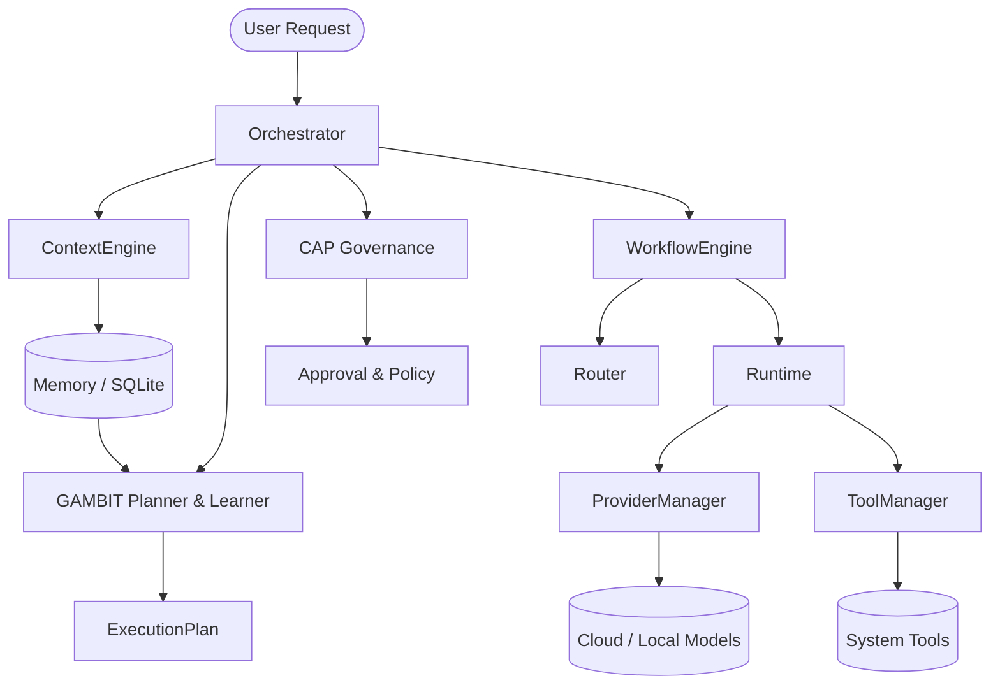
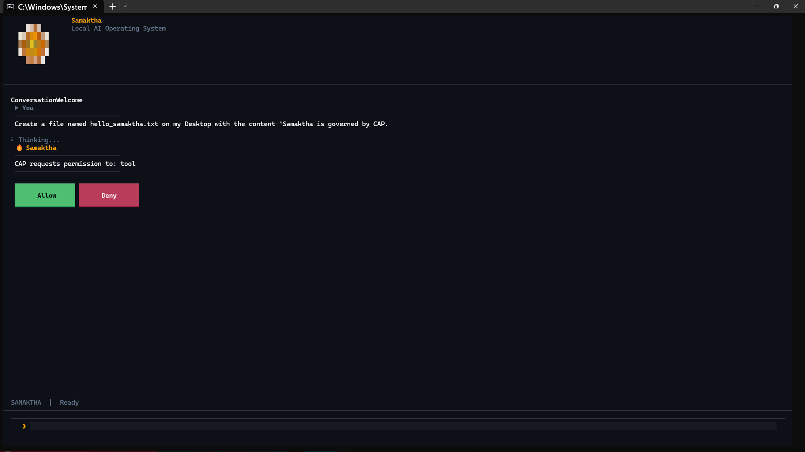
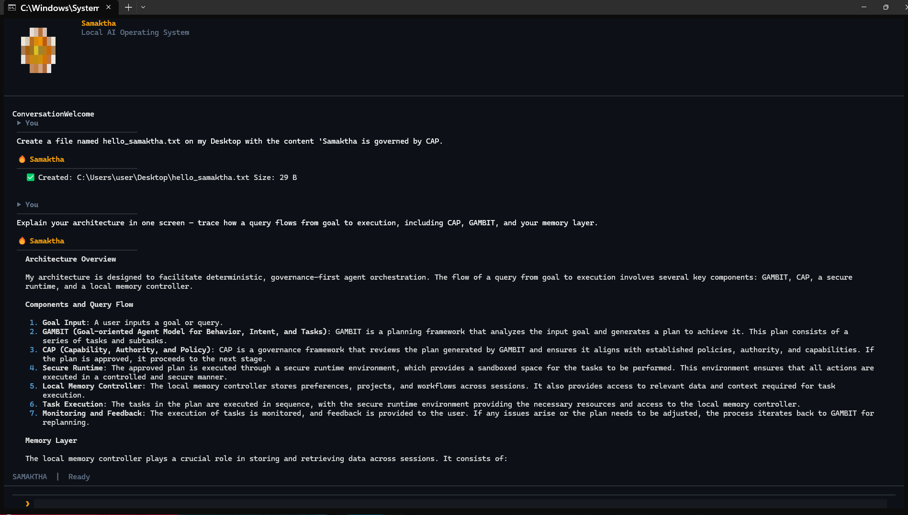
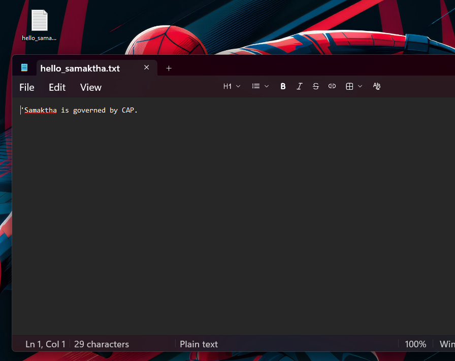
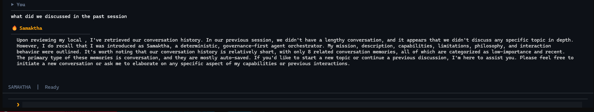

# Samaktha Core

**Current Stable Release:** Samaktha Core v0.5.0

> **A local-first AI agent infrastructure framework for controlled, observable, and policy-governed execution.**

Samaktha explores a core engineering problem in LLM-powered applications:

**How do you separate AI cognition from the execution of real-world actions?**

Instead of allowing an LLM to directly decide and perform side effects, Samaktha separates planning, governance, workflow coordination, runtime execution, providers, tools, memory, and context into explicit subsystems.

## Why Samaktha?

Many AI applications collapse these responsibilities into a single agent loop. That makes behavior harder to inspect, test, constrain, and evolve.

Samaktha takes a different approach:

```text
Think → Govern → Plan → Coordinate → Execute → Observe
```

The architecture is designed so that **cognition can propose actions while deterministic infrastructure controls how those actions are actually executed.**

> **Think in cloud → Act locally → Confirm everything.**

---

## 🧠 Architecture at a Glance



### Core Subsystems

| Subsystem           | Responsibility                                          |
| ------------------- | ------------------------------------------------------- |
| **CAP**             | Governance, policy, approval, and execution boundaries  |
| **GAMBIT**          | Planning, reflection, learning, and goal interpretation |
| **Workflow**        | Sequential execution coordination                       |
| **Runtime**         | Deterministic task execution and tracing                |
| **Router**          | Model/provider selection                                |
| **Memory**          | Sessions, context, persistence, and learned skills      |
| **ProviderManager** | Canonical boundary for model providers                  |
| **ToolManager**     | Canonical boundary for external/system tools            |

### Extended Capability Layers

* **Personality Engine** — behavior, intent, reflection, and response-style control.
* **Conversation Engine** — conversational continuity and memory synthesis.
* **Intelligence Layer** — RAG, knowledge graphs, learning, and reflection pipelines.
* **Internet Layer** — web intelligence and retrieval.
* **Tool Ecosystem** — filesystem, shell, calendar, contacts, notes, reminders, tasks, notifications, clipboard, and voice tools.
* **Voice Runtime** — streaming STT/TTS, VAD, and wake-word support.
* **Communication Hub** — communication integrations.
* **Developer Ecosystem** — developer-oriented tools and helpers.
* **Parallel / Multi-Agent Execution** — parallel task execution through `runtime_parallel`.
* **Windows TUI** — native terminal interface with themes, status information, and command history.

---

## 🖥️ Samaktha in Action

### 1. Human-in-the-Loop Execution

Before a tool operation is performed, CAP can request explicit user approval.



---

### 2. Governed Tool Execution

After approval, Samaktha executes the requested operation and reports the resulting system action.



---

### 3. Result on the Local System

The executed operation produces the requested artifact directly on the local Windows system.



---

### 4. Persistent Conversation Memory

Samaktha can retrieve relevant context from previous sessions.



---

## 📦 Repository Structure

```text
Samaktha/
├── app/
│   ├── agent/             # Agent personalities and production routing
│   ├── api/               # HTTP API layer
│   ├── communication/     # Communication integrations
│   ├── config/            # Application settings
│   ├── conversation/      # Conversational intelligence and memory
│   ├── core/              # CAP, GAMBIT, contracts, orchestration, events
│   ├── developer/         # Developer ecosystem tools
│   ├── fileparsers/       # Document parsing and writing
│   ├── intelligence/      # RAG, knowledge graph, learning pipelines
│   ├── internet/          # Web intelligence and retrieval
│   ├── memory/            # Storage, sessions, skills, context retrieval
│   ├── models/            # Shared data models
│   ├── personality/       # Personality and reflection engine
│   ├── providers/         # LLM provider implementations
│   ├── router/            # Execution routing
│   ├── runtime/           # Deterministic execution and tool integration
│   ├── runtime_parallel/  # Parallel execution engine
│   ├── security/          # Input scanning and redaction
│   ├── shell/             # Shell integration
│   ├── tools/             # Capability registry and adapters
│   ├── tui/               # Windows-native terminal UI
│   ├── utils/             # Shared utilities
│   ├── voice/             # STT/TTS, VAD, wake-word
│   ├── windows/           # Windows-specific helpers
│   └── workflow/          # Sequential coordination
├── docs/                  # Architecture, audits, changelog, release notes
├── tests/                 # Regression and subsystem tests
├── main.py                # Backend / TUI entry point
└── pyproject.toml         # Packaging and project metadata
```

---

## ⚙️ Requirements

* Python **3.12+**

## 🚀 Installation

```bash
git clone https://github.com/HARI9037/Samaktha.git
cd Samaktha
python -m venv .venv
# Windows: .venv\Scripts\activate
# Linux/macOS: source .venv/bin/activate
pip install -e .
```

## Running Locally

**Backend / FastAPI mode:**

```bash
python main.py
```

**Windows-native TUI mode:**

```bash
python main.py --tui
```

## Environment Variables

Create a `.env` file in the project root with the provider keys you intend to use:

```env
OPENAI_API_KEY=sk-...
GROQ_API_KEY=gsk-...
OPENROUTER_API_KEY=...
```

`.env` is gitignored and must never be committed.

---

## 🧪 Testing & Verification

Samaktha maintains a strict regression suite covering its core boundaries and subsystems.

Run the full suite with:

```bash
pytest
```

The repository currently contains **1,782 tests** covering the evolving architecture.

The test suite is an important part of the project's design philosophy:

> New capabilities should be introduced without silently weakening existing execution and governance boundaries.

---

## ✅ Current Capability Surface

The current codebase includes implementations across the following areas:

* Multi-provider model routing: OpenAI, Groq, OpenRouter, and local providers.
* Execution tracing and operation metrics.
* SQLite-backed memory and session persistence.
* Tool capability management and execution boundaries.
* Skill extraction, persistence, lifecycle management, decay, and archival.
* Multimodal context injection for image, audio, and video data.
* Streaming execution through SSE.
* Tool composition and tool chains.
* Security and privacy mechanisms including input filtering, output redaction, and ToolGuard.
* Personality, behavioral, and reflection systems.
* Session memory and conversational continuity.
* RAG and knowledge-graph-backed intelligence.
* Voice runtime components including STT, TTS, VAD, and wake-word support.
* Parallel and multi-agent task execution.
* Windows-native TUI with themes and command history.

These capabilities are actively evolving; the project should be evaluated from the implementation and tests in the repository rather than from architectural intent alone.

---

## 📚 Documentation

* [Changelog](docs/CHANGELOG.md)
* [Release Notes](docs/RELEASE_NOTES_v0.3.md)
* [Architecture State](docs/ARCHITECTURE_STATE.md)

Detailed phase designs and audit reports are available under `docs/`.

---

## 🗺️ Roadmap & Known Limitations

Samaktha is an actively evolving infrastructure project.

Current areas of development include:

* Expanding semantic memory and retrieval coverage.
* Evolving continuous long-term learning systems.
* Further hardening execution and security boundaries.
* Expanding provider, tool, and communication integrations.
* Improving the native Windows experience.

The project intentionally distinguishes **implemented capabilities** from **future architectural goals**; the documentation and test suite are the source of truth for current behavior.

---

## 🔐 License

Samaktha is proprietary software.

This repository is publicly available for demonstration, portfolio, transparency, and educational viewing purposes only.

No license is granted to copy, modify, redistribute, or commercially use any part of this project.

**Copyright © 2026 Sreehari R Nair. All Rights Reserved.**
