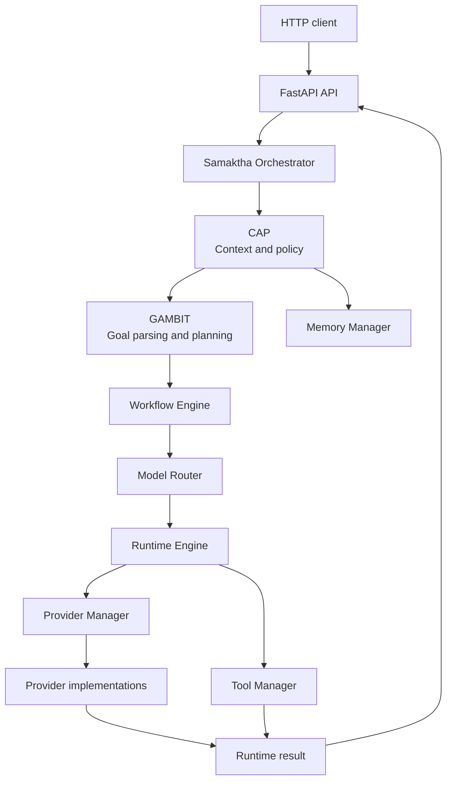
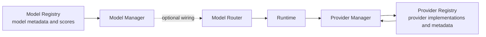
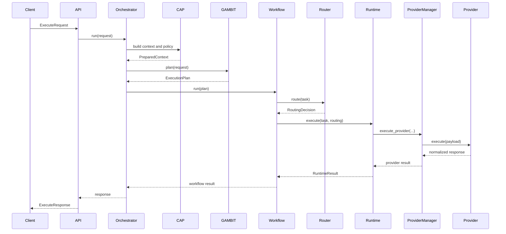

# Samaktha

Samaktha is an architecture-first Python service for coordinating AI-assisted tasks. The repository separates request governance, planning, model routing, provider execution, memory, tools, and HTTP delivery into independent subsystems with typed contracts between them.

The current implementation is a working Phase 1 AI infrastructure foundation. It includes deterministic planning and routing, a provider and model registry, provider health inspection, live provider adapters, optional streaming, fallback, usage and cost metadata, context validation, and in-memory provider metrics.

> [!NOTE]
> Provider health inspection performs configuration checks only. It does not ping providers or perform network connectivity checks. Network requests occur only when a provider is explicitly executed.

## Contents

- [Architecture](#architecture)
- [Execution Pipeline](#execution-pipeline)
- [Subsystem Responsibilities](#subsystem-responsibilities)
- [Repository Layout](#repository-layout)
- [Provider System](#provider-system)
- [Installation and Setup](#installation-and-setup)
- [Testing](#testing)
- [Development](#development)
- [Current Status](#current-status)
- [Roadmap](#roadmap)

## Architecture

Samaktha uses a staged orchestration pipeline. Each stage has a narrow responsibility and communicates with the next stage through Pydantic models or small Python protocols.



The provider boundary is deliberately independent from the model boundary:



## Execution Pipeline

For a normal request, the execution path is:

1. The API accepts an execution request and hands it to the orchestrator.
2. CAP builds context from the request and available memory, classifies privacy, evaluates policy, resolves ambiguity, and handles approval decisions.
3. GAMBIT parses the goal, estimates complexity and context, finds applicable skills, decomposes the goal into planned tasks, and produces an execution plan.
4. The Workflow Engine converts the plan into executable workflow tasks and coordinates their lifecycle.
5. The Model Router selects a provider/model registration using capability matching and the existing scoring policy.
6. Runtime dispatches provider-backed work to `ProviderExecutor` or tool-backed work to `ToolExecutor`.
7. `ProviderExecutor` calls `ProviderManager`, which performs provider availability checks, context validation, execution, response normalization, optional fallback, cooldown handling, usage and cost attachment, and metrics recording.
8. The orchestrator converts the runtime result into the final API response.



## Subsystem Responsibilities

### CAP

CAP is the context, authorization, and policy boundary. Its components build model context, retrieve relevant memory, classify privacy, evaluate action risk and permissions, resolve ambiguity, and determine whether approval is required. CAP does not select providers or execute tools.

### GAMBIT

GAMBIT turns a user goal into an executable plan. It parses goals, estimates complexity, searches the skill registry, decomposes work into tasks, reflects on outcomes, and builds workflow steps. GAMBIT describes work; it does not perform provider calls.

### Runtime

Runtime executes already-planned tasks. `RuntimeDispatcher` chooses an executor by task type. `ProviderExecutor` is the adapter for provider-backed work and `ToolExecutor` is the adapter for tools. Runtime returns typed `RuntimeResult` objects and remains unaware of provider-specific HTTP details.

### Model Router

The Model Router converts a routing request into a `RoutingDecision`. It matches registered provider/model combinations to requested capabilities and uses the existing scoring engine to rank candidates. It is provider-agnostic and does not perform provider health checks, retries, fallback execution, or network calls.

The model registry is a separate metadata layer. `ModelInfo` contains model identity, owning provider, context size, capability flags, reasoning/coding/speed/cost/privacy scores, and free-form metadata. `ModelManager` provides lookup and listing operations to application wiring and optional router integrations.

### Provider System

The Provider System owns provider registration, configuration, health inspection, selection, execution, and provider-specific response handling.

- `ProviderRegistry` stores provider implementations and `ProviderInfo` metadata.
- `ProviderManager` is the single entry point used by Runtime for provider management and execution.
- `ProviderHealthChecker` inspects enabled flags and required configuration without making network requests.
- `ProviderSelectionEngine` deterministically selects a configured provider using preferred provider/model, capability metadata, and registration order.
- `ProviderResponse` is the normalized response shape for success, content, provider/model identity, finish reason, usage, cost, latency, and metadata.
- `OpenAIProvider`, `GroqProvider`, and `OpenRouterProvider` use `httpx` and OpenAI-compatible chat completion endpoints when explicitly executed.
- `LocalProvider` supports a configurable local generation endpoint.
- `MockProvider` remains deterministic and does not make network calls.

ProviderManager also owns deterministic fallback, per-provider cooldown state, context-window validation, usage/cost attachment, and process-local metrics. It does not implement automatic discovery or external health monitoring.

### Memory

Memory provides a small persistence boundary for stored records. `MemoryManager` implements the memory interface, `MemoryRepository` coordinates storage, and the SQLite and in-memory stores provide concrete backends. CAP consumes memory through the `MemoryReader` contract; the rest of the orchestration pipeline does not depend on storage details.

### Tool System

The Tool System registers tool implementations and their capability metadata. `ToolManager` resolves tools for Runtime, while concrete tools such as the filesystem tool validate and perform their own operations. Tool execution is separate from provider execution and is not routed through ProviderManager.

## Repository Layout

```text
.
├── app/
│   ├── api/                 FastAPI routes and request/response schemas
│   ├── config/              Application settings
│   ├── core/
│   │   ├── cap/             Context, privacy, policy, approval, and ambiguity logic
│   │   ├── contracts/       Typed contracts shared across subsystem boundaries
│   │   ├── gambit/           Goal parsing, skills, planning, decomposition, reflection
│   │   ├── orchestrator/     Top-level pipeline coordination
│   │   └── app.py            Application and subsystem wiring
│   ├── memory/              Memory interfaces, managers, repositories, and stores
│   ├── models/              ModelInfo, ModelRegistry, and ModelManager
│   ├── providers/            Provider registry, health, selection, execution, and metrics
│   ├── router/               Capability registry, routing policy, and scoring
│   ├── runtime/              Runtime engine, dispatch, and task executors
│   ├── tools/                Tool interfaces, registry, manager, and implementations
│   └── workflow/             Workflow state, task models, and workflow execution
├── docs/                    Architecture status and milestone notes
├── tests/                   Subsystem and integration tests
├── main.py                  ASGI application entry point
└── README.md                Project documentation
```

## Provider System

Provider configuration is supplied through `ProviderSettings`, which reads the `SAMAKTHA_` environment prefix and optionally `.env`. The main settings include:

| Setting | Purpose |
| --- | --- |
| `SAMAKTHA_DEFAULT_PROVIDER` | Default provider identifier |
| `SAMAKTHA_OPENAI_API_KEY` | OpenAI API key |
| `SAMAKTHA_GROQ_API_KEY` | Groq API key |
| `SAMAKTHA_OPENROUTER_API_KEY` | OpenRouter API key |
| `SAMAKTHA_LOCAL_BASE_URL` | Local provider endpoint |
| `SAMAKTHA_*_ENABLED` | Provider enable flags |
| `SAMAKTHA_REQUEST_TIMEOUT_SECONDS` | HTTP timeout |
| `SAMAKTHA_MAX_OUTPUT_TOKENS` | Default output limit |
| `SAMAKTHA_COOLDOWN_SECONDS` | In-memory provider cooldown |
| `SAMAKTHA_STREAM_ENABLED` | Enable provider streaming |
| `SAMAKTHA_USAGE_ENABLED` | Attach usage metadata |
| `SAMAKTHA_COST_ENABLED` | Attach local cost estimates |
| `SAMAKTHA_FALLBACK_ENABLED` | Enable deterministic provider fallback |

Example local configuration:

```dotenv
SAMAKTHA_DEFAULT_PROVIDER=mock
SAMAKTHA_OPENAI_API_KEY=
SAMAKTHA_GROQ_API_KEY=
SAMAKTHA_OPENROUTER_API_KEY=
SAMAKTHA_LOCAL_BASE_URL=http://127.0.0.1:11434
SAMAKTHA_LOCAL_MODEL=local-default
SAMAKTHA_FALLBACK_ENABLED=true
```

The default application wiring registers `mock`, `openai`, `groq`, `openrouter`, and `local`. Cloud providers remain unavailable when their keys are absent; the mock provider is intended for deterministic local development and tests.

## Installation and Setup

Samaktha targets Python 3.11+ and uses FastAPI, Pydantic, `pydantic-settings`, `httpx`, and SQLite. Create a virtual environment and install the runtime and test dependencies:

```bash
python -m venv .venv

# Linux/macOS
source .venv/bin/activate

# Windows PowerShell
.venv\Scripts\Activate.ps1

python -m pip install fastapi uvicorn pydantic pydantic-settings httpx pytest pytest-asyncio
```

Set only the provider credentials and endpoints needed for the providers you intend to execute. No credentials are required to run the deterministic mock provider.

## Running the Service

Start the ASGI application from the repository root:

```bash
uvicorn main:app --reload
```

The application exposes health and execution routes through FastAPI. The exact request and response models are defined in `app/api/schemas.py`; interactive API documentation is available at `/docs` when the server is running.

## Testing

Run the complete test suite with:

```bash
python -m pytest
```

Compilation can be checked independently:

```bash
python -m compileall -q app main.py tests
```

Provider tests mock network boundaries. The test suite does not require paid API access and should not be configured with production credentials for ordinary development.

## Development

Keep changes within the owning subsystem and use the existing contracts when crossing boundaries. In particular:

- Runtime should interact with providers through `ProviderManager`.
- Router should make routing decisions, not execute providers.
- CAP and GAMBIT should remain independent of provider-specific HTTP details.
- Provider implementations should return the normalized `ProviderResponse` shape.
- New model metadata belongs in the model registry; provider metadata belongs in `ProviderInfo`.
- Network behavior should be covered with mocked HTTP tests.

Before submitting a change, run compilation and the full test suite. Update `docs/ARCHITECTURE_STATE.md` when a milestone changes the implemented architecture.

## Current Status

### Implemented: Phase 1 AI Infrastructure

- CAP context, privacy, policy, approval, and ambiguity boundaries
- GAMBIT goal parsing, skill lookup, decomposition, planning, and reflection foundations
- Workflow state and task execution coordination
- Runtime dispatch with provider and tool executors
- Model Registry v0.1 and Model Manager
- Provider Registry and Provider Manager
- Configuration-only Provider Health System
- Deterministic Provider Selection Engine
- OpenAI-compatible execution for OpenAI, Groq, and OpenRouter through `httpx`
- Configurable local provider endpoint
- Deterministic MockProvider
- Optional provider streaming
- Deterministic fallback without retrying a provider twice
- In-memory cooldown handling for rate-limit and temporary execution failures
- Context-window validation from provider/model metadata
- Normalized provider responses
- Token usage tracking, local cost estimation, and process-local provider metrics
- SQLite and in-memory memory backends
- Filesystem tool registration and execution
- FastAPI health and execution routes

### Deliberately outside the current implementation

- Dynamic model discovery
- External provider health pings or monitoring
- Redis-backed state
- Embeddings
- Audio or vision execution
- Function calling and provider tool-call protocols
- Automatic billing reconciliation
- Distributed metrics, queues, and multi-process coordination

See [`docs/ARCHITECTURE_STATE.md`](docs/ARCHITECTURE_STATE.md) for milestone-level detail.

## Roadmap

### Phase 1: AI Infrastructure — completed

Establish the architectural foundation: contracts, CAP, GAMBIT, Runtime, Workflow, routing, registries, provider management, memory, tools, configuration, normalized provider execution, streaming, fallback, usage, cost, context validation, and local metrics.

### Phase 2: Integration

Strengthen integration across the existing boundaries: broader end-to-end workflows, expanded provider/model registrations, more complete API behavior, stronger persistence and observability, and additional contract-level test coverage. Phase 2 work should preserve the separation between planning, routing, execution, memory, and tools.

### Phase 3: Intelligence

Add higher-level intelligence to the established interfaces: richer model selection, improved planning and reflection, more capable context strategies, and policy-aware orchestration. These capabilities should extend the current contracts rather than bypassing them.

### Future phases

Potential later work includes distributed execution, durable queues, external metrics, dynamic discovery, richer provider protocols, embeddings, multimodal execution, and production-grade authentication and deployment. These are not part of the current implementation.

## License

No license file is currently included in the repository.
