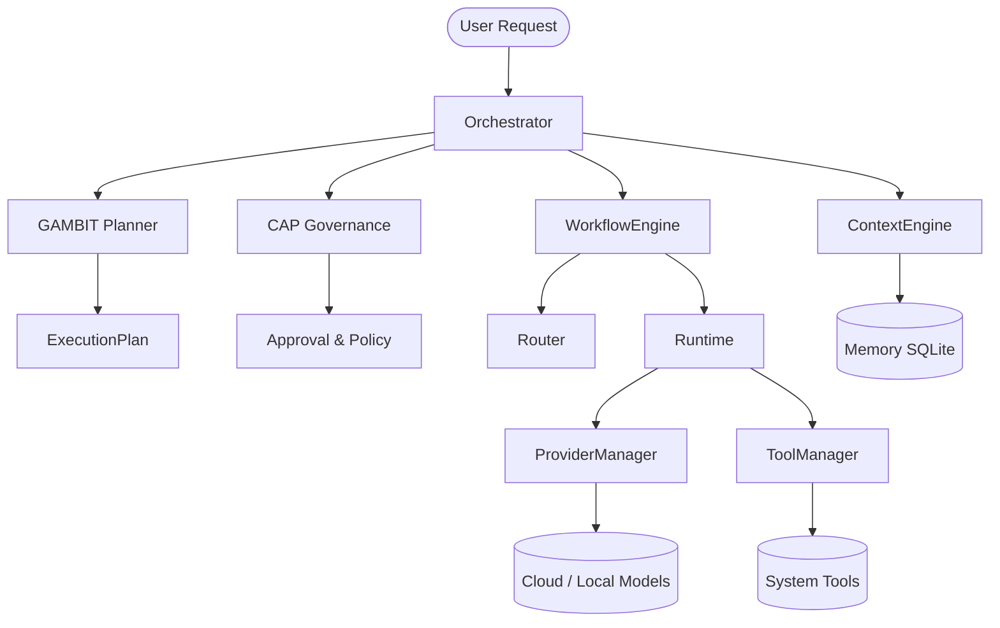

# Samaktha Core

**Current Stable Release:** Samaktha Core v0.2

**Phase Status:**
- ✅ Phase 1 Complete
- ✅ Phase 2 Complete
- ⬜ Phase 3 Planned
- ⬜ Phase 4 Planned

---

## Project Overview
Samaktha is a next-generation AI infrastructure framework built to resolve the fundamental boundary problem in LLM-powered applications. Traditional AI wrappers dangerously conflate cognitive behaviors (planning) with deterministic flow (execution). Samaktha provides an unbreakable architectural structure designed to safely sandbox advanced AI cognition behind strict, observable, and policy-governed boundaries. 

## Vision
The goal of Samaktha is to provide the deterministic foundation necessary to safely build autonomous, goal-directed AI agents. The infrastructure guarantees that no agent can bypass safety guardrails, hallucinate unauthorized executions, or operate outside a metered, fully observable environment.

## Current Architecture
Samaktha enforces execution through completely decoupled subsystems mapped by rigid protocols. Subsystem integrations rely exclusively on a generic `contracts` domain. 

### Subsystems:
- **CAP (Cognitive Alignment and Policy):** The sole governance engine.
- **GAMBIT (Goal-directed Autonomous Meaning and Behavioral Intent Translator):** The exclusive cognitive planner.
- **Workflow:** The sequential execution coordinator.
- **Runtime:** The deterministic task execution engine.
- **Router:** The intelligent provider selection protocol.
- **ProviderManager & ToolManager:** The strict canonical boundaries for all external interactions.

## Architecture Diagram


## End-to-End Execution Flow
1. **Receive:** The Orchestrator accepts a user request, allocating Context and an ExecutionTrace.
2. **Retrieve:** The Context Engine loads short and long-term memory.
3. **Plan:** GAMBIT intelligently breaks down the request into discrete tasks.
4. **Govern:** CAP audits the plan for safety and risk compliance.
5. **Coordinate:** The Workflow Engine sequences the tasks.
6. **Route:** The Router optimally selects providers and models for each task.
7. **Execute:** The Runtime executes the sequence, locking interactions behind Provider/Tool managers.
8. **Report:** Traces, metrics, and outcomes are synthesized into an `ExecutionReport` and returned.

## Repository Structure
```text
Samaktha/
├── app/
│   ├── api/             # API layer and routing
│   ├── core/            # Core systems (CAP, GAMBIT, contracts, orchestrator)
│   ├── memory/          # Storage and context retrieval
│   ├── providers/       # LLM provider implementations
│   ├── router/          # Execution routing logic
│   ├── runtime/         # Deterministic execution and tool integration
│   ├── tools/           # Functional capabilities
│   └── workflow/        # Sequential coordination
├── docs/                # Architecture state and technical documentation
├── tests/               # 181-test strict regression suite
├── CHANGELOG.md         # Release history
├── RELEASE_NOTES_v0.2.md# Current release summary
└── README.md            # Project overview
```

## Installation
Ensure you have Python 3.11+ installed.
```bash
git clone https://github.com/your-org/Samaktha.git
cd Samaktha
python -m venv .venv
source .venv/bin/activate  # On Windows: .venv\Scripts\activate
pip install -r requirements.txt
```

## Running Locally
To launch the API server locally:
```bash
uvicorn app.main:app --reload
```

## Environment Variables
Create a `.env` file in the project root:
```env
OPENAI_API_KEY=sk-...
ANTHROPIC_API_KEY=sk-...
GROQ_API_KEY=gsk-...
```

## Running Tests
Run the entire regression suite (181 tests) to verify boundary integrity:
```bash
pytest
```

## Current Capabilities
- Multi-provider dynamic routing.
- Complete execution determinism.
- Sophisticated in-memory operation metrics.
- High-resolution timeline tracing.
- SQLite-backed memory indexing.
- Tool capability sandboxing.

## Completed Phase 1
- Initial framework scaffolding.
- Provider abstract factories and capability registries.
- Basic API structure.

## Completed Phase 2
- Total architectural decoupling across CAP, GAMBIT, Workflow, and Runtime.
- `app.core.contracts` boundary hardening (zero circular dependencies).
- Strict canonical execution pipelines (`ToolManager`, `ProviderManager`).
- Deep observability via `ExecutionReport`, `ExecutionTrace`, and distributed `MetricsCollectors`.
- Comprehensive testing (181 tests).

## Current Limitations
- Memory relies on keyword-based retrieval rather than semantic vector embeddings.
- Metrics are independently tracked rather than unified under a core observable interface.
- GAMBIT does not currently support recursive, goal-seeking reflection loops.

## Roadmap
**Phase 3 (Next Phase):**
- Introduce autonomous agents.
- Implement reflection and self-correcting logic in GAMBIT.
- Upgrade the memory system with Semantic Vectors / RAG.

**Phase 4:**
- Distributed execution scaling.
- Advanced multi-agent orchestration.
- Long-term continuous learning systems.

## Contributing
Please see `CONTRIBUTING.md` for details on our code of conduct, and the process for submitting pull requests. All PRs must maintain 100% test coverage and preserve architectural invariants.

## License
This project is licensed under the MIT License - see the `LICENSE` file for details.
