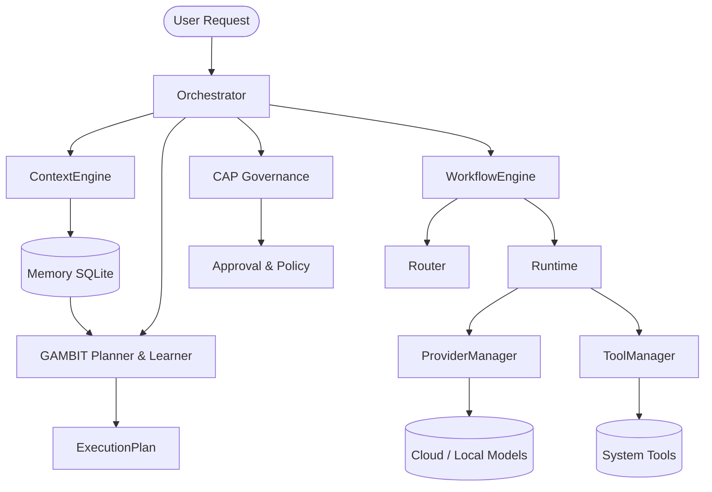

# Samaktha Core Architecture

## Overview
Samaktha Core is engineered to enforce absolute determinism within AI execution environments. Unlike traditional LLM wrappers where cognitive behavior frequently bleeds into control logic, Samaktha enforces a rigid, uncompromising boundary separating the planning phase (cognitive) from the execution phase (deterministic). Phase 3 solidifies this infrastructure by delivering a purely deterministic Cognitive Layer (Reflection, Learning, Skill Memory) that operates entirely within the persistence boundary, completely safely decoupled from autonomous loops.

## Architecture Diagram

## Execution Flow
1. **Request Reception:** `SamakthaOrchestrator` receives a user request, allocating a unique `RuntimeContext` and initiating an `ExecutionTrace`.
2. **Context Assembly:** `ContextEngine` retrieves relevant short-term conversation logs and long-term memory via the `MemoryManager`.
3. **Cognitive Planning:** `GAMBIT` digests the request, injects active learned skills retrieved from `MemoryManager`, and generates a discrete, multi-step `ExecutionPlan`.
4. **Governance Review:** `CAP` evaluates the action plan against the policy engine, either granting approval or halting execution immediately.
5. **Workflow Coordination:** `WorkflowEngine` sequentially translates the approved execution plan into actionable runtime tasks.
6. **Task Routing:** `Router` evaluates required capabilities and context constraints, mapping tasks to optimal providers via the `ModelRegistry`.
7. **Task Execution:** `Runtime` executes tasks by invoking `ProviderManager` or `ToolManager`. Bypassing these managers is strictly prohibited.
8. **Reporting & Observability:** The `WorkflowEngine` synthesizes the `ExecutionReport`, aggregating metrics, timing data, and hierarchical traces before resolving back to the Orchestrator.
9. **Reflection & Learning:** `GAMBIT` analyzes the returned trace and report, extracts high-value task sequences into reusable `SkillCandidate`s, and persists them via `MemoryManager`.

## Subsystem Boundaries
- **Contracts (`app.core.contracts`):** The isolated foundation of the system. All subsystems rely on `contracts`, but `contracts` rely on nothing.
- **CAP:** Responsible purely for security, policy, and privacy governance.
- **GAMBIT:** Exclusively responsible for cognitive planning, reflection, and learning extraction.
- **Workflow:** Strictly coordinates execution flow. Contains zero intelligent behavior.
- **Runtime:** Strictly handles execution mechanics. Contains zero planning or coordination logic.
- **Router:** Deterministically selects optimal provider configurations based on metrics and rules.
- **MemoryManager:** Owns the lifecycle, decay, and persistence of extracted cognitive skills.

## Provider Architecture
`ProviderManager` serves as the absolute canonical boundary for model interactions. It supports dynamic registration of heterogeneous models (OpenAI, Groq, OpenRouter, Local), handles rate-limit back-offs, applies token/cost utilization tracking, and enforces transient failure recovery.

## Tool Architecture
`ToolManager` serves as the canonical boundary for system tools. Any task invoking a system tool must pass through `ToolManager.execute_tool`, ensuring complete operational visibility, metric collection, and structured error reporting.

## Memory Architecture
The cognitive storage system (`MemoryManager`) utilizes an SQLite persistence store. It provides key-value storage enhanced with relevance scoring and categorical indexing to empower deterministic search and retrieval, and also owns the complete lifecycle (usage tracking, decay, deprecation) of learned skills.

## Execution Reporting
`ExecutionReport` is a standardized diagnostic manifest generated at the conclusion of every workflow. It securely packages task success flags, partial failure notes, granular durations, and outputs into a clean response structure.

## Execution Tracing
A sophisticated observability timeline tracks granular sub-millisecond execution patterns. Using `ExecutionTrace` and `TimelineEvent` abstractions homed in the core contracts, events are generated deep within the provider and tool layers without polluting internal logic.

## Metrics
Deterministic telemetry strictly records system operations without external infrastructure. `OrchestratorMetricsCollector`, `RouterMetricsCollector`, `WorkflowMetricsCollector`, `ToolMetricsCollector`, `SkillMetricsCollector`, and `ProviderMetrics` track operational successes, latencies, and lifecycle states in memory.

## Testing Strategy
The architecture guarantees integrity via a 246-test regression suite. Test cases systematically validate isolated subsystem boundaries, partial execution failure modes, metric accrual correctness, deterministic learning constraints, and circular dependency prevention.

## Architectural Decisions
1. **Strict Depedency Inversion:** Implementation logic is never leaked into `app.core.contracts`.
2. **Centralized Execution Boundaries:** Invoking a tool or provider directly is treated as a critical failure. All executions flow through the respective Managers.
3. **No Autonomous Loops in Workflow:** `WorkflowEngine` strictly sequentially executes. Goal-directed loops must exist at the agent level.
4. **Learning is Persistence-Only:** Extraction of skills is strictly analytical and side-effect free, persisting through standard memory boundaries without autonomous loops.

## Current Constraints
- Subsystem Metrics currently lack a unified observable base contract.
- GAMBIT does not currently support recursive, goal-seeking autonomous background loops.
- Search remains fundamentally keyword-driven (no embeddings).

## Future Work
With infrastructure and cognitive learning safely established in Phase 3, Phase 4 will introduce distributed execution scaling, semantic vector memory, and autonomous multi-agent orchestration.
