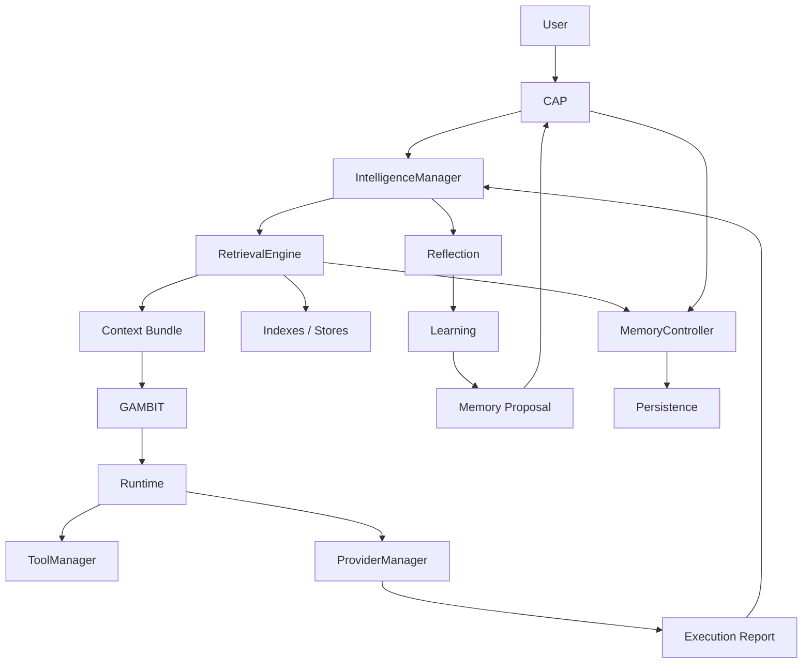

# Phase 17 Intelligence Architecture

Date: 2026-08-03

## Purpose

Phase 17 defines the long-lived intelligence layer that lets Samaktha learn,
reflect, and improve without violating the established trust boundaries from
Phases 1 through 16.

This phase is architecture-only. It does not add production code.

## Design Goals

- Make intelligence deterministic wherever analysis is structural or
  evidence-based.
- Keep every intelligence responsibility owned by exactly one subsystem.
- Preserve the boundary between planning, execution, learning, retrieval,
  storage, and governance.
- Prevent overlap between CAP, GAMBIT, Runtime, Memory, RAG, Learning, and
  Reflection.
- Prevent hallucination by requiring evidence-linked outputs.

## Ownership Matrix

The final ownership model is:

- CAP owns governance.
- IntelligenceManager owns intelligence orchestration.
- RetrievalEngine owns retrieval, ranking, deduplication, provenance assembly,
  and confidence scoring.
- MemoryController owns storage access and persistence operations.
- Memory owns stored knowledge and lifecycle state.
- GAMBIT owns planning.
- Runtime owns execution.
- ToolManager owns tool execution.
- ProviderManager owns provider execution.
- Reflection owns analysis of completed execution.
- Learning owns proposal generation and persistence candidates.
- Skill Runner owns reusable skill expansion.

## Master Diagram

## Intelligence Stack

The Phase 17 stack is organized into five layers:

1. Observation
2. Analysis
3. Reflection
4. Learning
5. Persistence

### 1. Observation

Observation is the read-only intake layer. It gathers:

- conversation traces
- tool execution traces
- runtime execution reports
- repository and code intelligence summaries
- test outcomes
- build and CI signals
- workspace topology

Observation never mutates state and never invokes providers or tools directly.

### 2. Analysis

Analysis converts observations into evidence structures:

- explicit facts
- confidence scores
- source references
- change deltas
- failure clusters
- dependency signals
- regression candidates

Analysis is deterministic when the input is deterministic. It does not invent
missing details.

### 3. Reflection

Reflection evaluates completed work against expected outcomes.

Outputs include:

- what happened
- what was expected
- what failed
- what stayed stable
- what should be remembered
- what should not be remembered

Reflection is always read-only. It can propose learning actions, but it cannot
apply them directly.

### 4. Learning

Learning decides what should be persisted and how long it should remain useful.

Learning artifacts:

- skills
- project facts
- repository facts
- code relationships
- regression heuristics
- confidence calibration data

Learning never bypasses Memory governance and never stores unsupported claims.

### 5. Persistence

Persistence stores approved learning artifacts in the appropriate long-term or
temporary memory surfaces.

Persistence targets:

- long-term memory for stable reusable knowledge
- session memory for temporary task-local context
- skill memory for reusable procedural knowledge

## Core Architecture Boundaries

- CAP remains the governance authority for risky or destructive actions.
- IntelligenceManager orchestrates intelligence lifecycle steps but never owns
  storage, execution, or planning.
- GAMBIT remains the planning engine and may consume learned knowledge, but it
  never performs reflection or memory mutation.
- Runtime remains the executor only.
- ToolManager remains the sole tool execution entry point.
- ProviderManager remains the sole provider execution entry point.
- Memory stores knowledge; it does not rank, plan, reflect, or assemble prompts.
- Internet remains governed and read-only from the intelligence layer unless a
  higher-level plan explicitly authorizes network use.
- Voice and communication subsystems remain untouched by intelligence
  persistence.

## Intelligence Objects

Phase 17 is centered on the following logical objects:

- ObservationRecord
- EvidenceItem
- ReflectionReport
- ReflectionMetrics
- LearningCandidate
- ConfidenceAssessment
- HallucinationGuard
- MemoryProposal
- SkillCandidate
- RetrievalContextBundle

These are conceptual architecture objects only. They define the intended data
shape for future implementation.

## Learning Sources

The system may learn from:

- completed runtime traces
- repository structure
- code structure
- review findings
- test failures
- CI failures
- repeated user corrections

The system may not learn from:

- unsupported model guesses
- speculative inference without evidence
- private data that CAP classifies as disallowed
- transient noise without recurrence

## Learning Policy

All learning actions must satisfy:

- evidence present
- provenance attached
- confidence threshold met
- scope bounded
- storage target selected
- expiry or refresh policy defined

If evidence is insufficient, the system records the observation but does not
promote it to durable memory.

## Planning Evolution

GAMBIT owns:

- Goal understanding
- Task decomposition
- Capability matching
- Dependency graph generation
- Execution planning
- Plan optimization
- Runtime execution strategy

GAMBIT never owns:

- Reflection
- Learning
- Memory mutation
- Knowledge evolution
- Confidence calibration
- Long-term retrieval implementation
- Skill formation

Planning ends when Runtime begins.

GAMBIT’s planning loop evolves from a single-shot plan generator into a
knowledge-aware planner that can:

- retrieve prior similar plans
- compare intended versus actual outcomes
- reuse prior successful strategies
- avoid prior failure patterns
- adjust plan decomposition based on learned project topology

This evolution remains deterministic and never becomes autonomous self-modifying
reasoning.

## Self-Evaluation Pipeline

The self-evaluation pipeline is:

1. Observe the completed action or task.
2. Extract evidence from trace, logs, and artifacts.
3. Classify the outcome.
4. Compare actual outcome to expected outcome.
5. Score confidence.
6. Decide whether a memory update is justified.
7. Route proposed memory updates through governance.
8. Persist approved learning.

## Confidence Architecture

Confidence is split into independent domains:

- Evidence Confidence
- Retrieval Confidence
- Reasoning Confidence
- Execution Confidence
- Memory Confidence
- Learning Confidence

Each domain has its own purpose, update triggers, and consumers.

Confidence never substitutes for proof.

## Hallucination Prevention Strategy

Hallucination prevention is enforced by architecture:

- evidence-only outputs
- source-linked assertions
- no memory write without provenance
- no recommendation without supporting signals
- no speculative root-cause claims
- no missing-data filling

If the system cannot justify a claim from evidence, it must say the claim is
unknown or unsupported.

## Relationship to Existing Phases

- Phase 12 provides governed internet access.
- Phase 13 provides governed tool execution.
- Phase 14 and 15 provide voice and communication surfaces.
- Phase 16 provides repository, code, process, review, and workspace
  intelligence.
- Phase 17 defines how those observations are converted into durable learning.

## Event Architecture

Subsystems communicate conceptually through events:

- Runtime Finished
- ReflectionRequested
- LearningProposalCreated
- MemoryProposalReady
- GovernanceApprovalRequested
- MemoryPersisted

This phase does not introduce an event bus implementation.

## Intelligence Versioning

Every learned artifact records:

- Intelligence Version
- Learning Version
- Reflection Version
- Retrieval Version
- Timestamp
- Provenance

Future algorithm changes may selectively rebuild learned artifacts from those
versioned records.

## Non-Goals

- No autonomous agent loops.
- No direct provider calls outside ProviderManager.
- No direct tool calls outside ToolManager.
- No direct Git execution outside ToolManager.
- No hidden background learning.
- No unbounded self-modification.
- No implementation of the intelligence orchestrator, retrieval engine, or
  knowledge graph in this phase.
