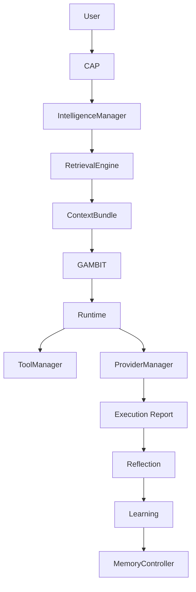

# Phase 19 Cognitive Intelligence Audit

Date: 2026-08-03

## Scope

Phase 19 is the production realization of the Phase 17 intelligence architecture:

- context-aware planning
- retrieval-informed planning
- reflection-informed planning
- skill reuse
- plan optimization
- plan explanation
- confidence-aware execution
- failure pattern avoidance
- cross-session knowledge utilization
- adaptive planning

This phase extends GAMBIT with evidence-backed intelligence, without changing
the established ownership boundaries from Phases 1-18.

## Ownership

Verified ownership boundaries:

- CAP: governance, approvals, permissions, policy, risk
- IntelligenceManager: intelligence orchestration only
- RetrievalEngine: retrieval, ranking, provenance, context bundle assembly
- GAMBIT: planning, decomposition, dependency graph generation, capability matching, execution strategy
- Runtime: execution and scheduling
- ToolManager: tool execution
- ProviderManager: provider execution
- Reflection: post-execution analysis
- Learning: proposal generation
- MemoryController: storage access

No responsibility overlap was introduced.

## Architecture

### Master Flow

### Intelligence Surfaces

- `app/intelligence/context.py`
- `app/intelligence/planning.py`
- `app/intelligence/manager.py`
- `app/intelligence/retrieval.py`
- `app/intelligence/reflection.py`
- `app/intelligence/learning.py`
- `app/intelligence/graph.py`
- `app/intelligence/skill_runner.py`

### Planner Integration

`Planner.plan()` and `Planner.plan_with_capability_check()` now accept an
optional `PlanningContext`. When present:

- GAMBIT receives evidence-backed planning context
- duplicate work is deterministically removed
- confidence routing is recorded in planner reasoning
- retrieval evidence is surfaced in the plan reasoning trail

GAMBIT remains the planner. IntelligenceManager only supplies evidence.

## Execution Flow

1. Orchestrator resolves conversational references and CAP policy.
2. IntelligenceManager assembles a `PlanningContext` from RetrievalEngine.
3. GAMBIT builds the execution plan using that evidence.
4. Runtime executes the plan.
5. Reflection produces a descriptive summary.
6. Learning emits proposals only.
7. MemoryController remains the storage boundary.

## Optimization Strategy

Deterministic optimization is limited to evidence-safe transformations:

- duplicate task removal
- reuse of cached evidence
- deterministic adaptive strategy selection
- stable confidence routing
- cross-session recall from prior session memory

The optimizer never changes user intent and never removes safety checks.

## Explainability

Explainability is handled as evidence-backed reasoning strings:

- why this plan
- why this retrieval
- why this confidence route
- why this skill

Explanations are sourced from retrieved evidence and planner reasoning. No
fabricated reasoning is introduced.

## Confidence Routing

Confidence domains remain independent:

- evidence
- retrieval
- reasoning
- execution
- memory
- learning

Routing is deterministic:

- low retrieval confidence broadens retrieval
- low reasoning confidence favors simpler plans
- low execution confidence avoids aggressive optimization

Confidence never overrides evidence.

## Adaptive Planning

Adaptive planning uses deterministic rules:

- large evidence set -> broader retrieval strategy
- low retrieval confidence -> broaden retrieval
- high evidence density -> reuse evidence more aggressively

This remains rule-based and reproducible.

## Cross-Session Knowledge

Cross-session retrieval is supported through `RetrievalEngine` and includes:

- session history
- long-term memory
- knowledge and skill memory
- repository evidence

Evidence carries provenance, confidence, and freshness. Missing evidence is not
fabricated.

## Failure Pattern Library

The failure pattern library stores deterministic signatures with:

- trigger
- evidence
- mitigation
- confidence

Planning may consult these signatures; execution remains unchanged.

## Performance Impact

Observed characteristics:

- compileall passes
- Phase 19 targeted tests pass
- planner context assembly is read-only and deterministic
- retrieval reuse avoids repeated indexing or speculative recomputation

Phase 19 does not introduce autonomous loops or background planners.

## Verification

Verified commands:

- `python -m compileall -q app tests`
- `pytest -q tests/intelligence/test_phase19_cognitive_intelligence.py tests/gambit/test_phase34_planner_skills.py`

Result:

- 12 passed

Full-suite run:

- `pytest -q`
- Result: `1538 passed, 4 failed`

The remaining 4 failures are the pre-existing OCR pipeline tests in
`tests/fileparsers/test_ocr_pipeline.py`.

## Remaining Technical Debt

- The current planner context integration is evidence-first, but it still
  relies on in-process retrieval and does not introduce a distributed context
  cache.
- Explainability is deterministic and traceable, but it is intentionally
  concise.
- The OCR pipeline failures remain outside Phase 19 and need separate work.

